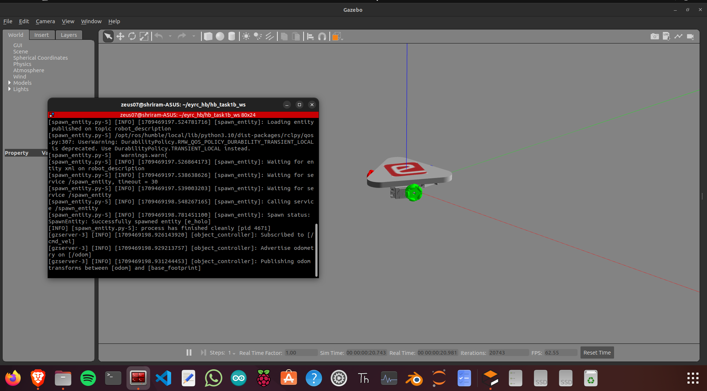
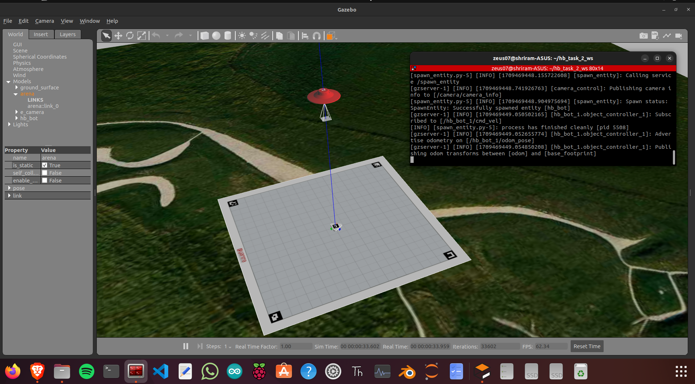
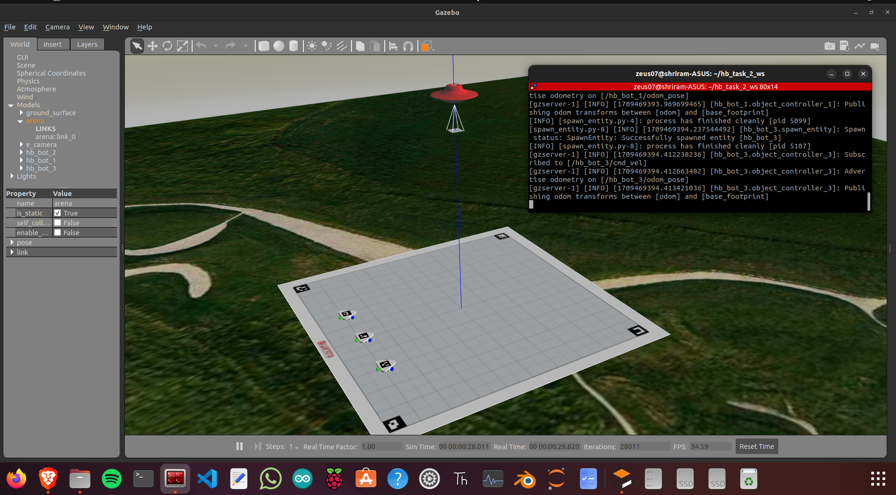

# eYantra  
ROS2 Code for Stages 1 and 2 of the eYantra Robotics Competition  
**Theme: Hologlyph Bots**

This repository contains the **ROS2 implementation** developed for **Stage 1 and Stage 2** of the eYantra Robotics Competition under the **Hologlyph Bots** theme.  
All tasks, algorithms, and robot behaviors implemented here follow the official eYRC specifications for navigation, perception, and task automation.

---

## 📸 Competition Theme Overview

The Hologlyph Bots theme introduces challenges involving:
- Autonomous mobile robot navigation  
- Object detection and glyph recognition  
- Precise pose estimation  
- Task execution based on encoded hologlyph instructions  

This repo includes all ROS2 packages, launch files, and task logic needed for completing Stages 1 and 2.

---

## 🚀 Stage 1 – Simulation & Basic Autonomy

Stage 1 focuses on validating fundamental robot behaviors in simulation, including:

### 🔹 Motion and Path Execution  
- Linear and angular velocity control  
- Differential-drive kinematics  
- Trajectory tracking

### 🔹 Basic Perception  
- Camera frame acquisition  
- Preprocessing and filtering  
- Line/glyph region detection  

### 🔹 ROS2 Nodes Implemented  
- `cmd_vel` controller  
- Camera subscriber node  
- Basic perception pipeline  
- Stage 1 evaluation node  

---

## 🧠 Stage 2 – Perception + Navigation + Glyph Interpretation

Stage 2 requires integration of perception, navigation, and task planning:

### 🔹 Glyph Detection & Processing  
- Extracting hologlyph regions  
- Decoding symbols  
- Associating tasks with glyph content  

### 🔹 Autonomous Navigation  
- Map-based motion planning  
- Pose estimation  
- Obstacle handling  
- Decision-making based on glyph instructions  

### 🔹 ROS2 Nodes Implemented  
- Navigation behavior tree  
- Glyph detection pipeline  
- Mission controller node  
- Integration launch files for full execution  

---

## 📦 Repository Structure (Suggested)

